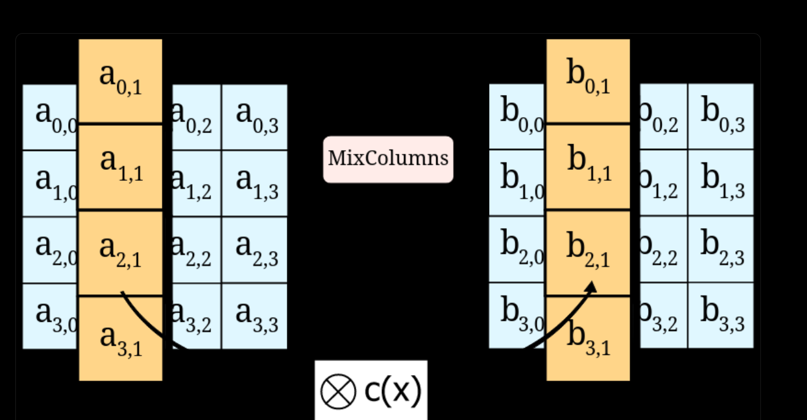

# What is AES
AES has been the standard encryption method used by the US federal government for 20 years, and it still remains a de-facto standard for securing digital data to this day. In fact, AES is so trustworthy it’s one of the two encryption methods we use at Onboardbase to store secrets.

There are dozens of encryption algorithms out there, but the most commonly used is AES―short for <b> Advanced Encryption Standard </b>, also known as Rijndael. AES is an encoding algorithm that transforms plain text data into a version known as ciphertext that’s not possible for humans or machines to understand without an encryption key―a password.

## Symmetric Vs Asymmetric Encryption
AES is a <b> symmetric-key algorithm </b>, meaning the same key (aka passphrase or password) is used to encrypt and decrypt the data. This characteristic presents pros and cons detailed in the following sections.

Asymmetric methods use a public key for encryption and a secret key for decryption. Anyone can send encrypted messages but only the receiver knows how to decrypt them. TLS certificates used for secure HTTP communication (HTTPS) leverage asymmetric encryption, for example.

## Why AES Encryption 
First,<b> encryption is a vital part of software development </b>. You use it everywhere: you need API keys to interact with web services, you need TLS certificates to send data over the Internet, you need passwords to implement user accounts, etc. Understanding how AES encryption works and how you can use it reduces the risk of potential data breaches.

AES encryption is <b>virtually unbreakable</b> as it would take years to brute-force a key. It’s so secure that governments use it to encrypt top-secret files. Its mathematical properties make it less vulnerable to potential attacks than other encryption methods out there, like Blowfish or Twofish.

AES encryption is also among the fastest symmetric encryption algorithms, making it <b> more practical to use at scale in real-life applications </b> than slower counterparts like Serpent. With data privacy becoming dearer to end-users, it’s vital to take into account encryption speed in data-intensive applications like instant messaging platforms implementing E2E encryption―if it took minutes to encrypt a message, the software would become unusable


## How AES Encryption Works
## 1. Overview Of The AES Algorithm
1. Generate a key
2. Generate a cipher
3. Encrypt/decrypt the data with the cipher

### Generating the AES key

AES requires a secret passphrase known as a “key” to encrypt/decrypt data. Anybody with the key can decrypt your data, so you need it to be strong and hidden from everyone―only the software program should be able to access it.

The key can be either 128, 192, 256, or 512 bit long. An AES cipher using a 512-bit key is abbreviated as AES 512, for example. The longer the key, the more secure it is, but the slower the encryption/decryption will be as well. 128 bits is equivalent to 24 characters in base64 encoding, 44 characters for 256 bits. Since storage space isn’t usually a problem and the difference in speed between the versions is negligible, a good rule of thumb is to use 256-bit keys.

### Generating the cipher
The cipher is a set of instructions that tell the AES algorithm how to encrypt/decrypt data. It’s generated from the key using a process called key expansion. The cipher is unique to each key, so you need to generate a new one every time you change the key.

### Encrypting/decrypting the data
AES operates on data blocks of 16 bytes represented as 4x4 two-dimensional arrays. The byte content of these matrices is transformed using a mathematical function defined by the cipher (also called block cipher), which gives us a ciphertext―the encrypted result.



## 2. AES Implementation in Python Using PyCryptodome
#### Encryption
```
    key = get_random_bytes(16)
    cipher = AES.new(key, AES.MODE_EAX)
    ciphertext, tag = cipher.encrypt_and_digest(data)
    nonce = cipher.nonce
    return key, cipher, ciphertext, tag, nonce
```
#### Decryption
```    
    cipher = AES.new(key, AES.MODE_EAX, nonce)
    data = cipher.decrypt_and_verify(ciphertext, tag)
    return data
```
#### what is nonce?
A nonce is an arbitrary number that can be used just once in a cryptographic communication. It is similar in spirit to a nonce word, hence the name. It is often a random or pseudo-random number issued in an authentication protocol to ensure that old communications cannot be reused in replay attacks. They can also be useful as initialization vectors and in cryptographic hash functions.

##### fun fact about nonce in bitcoin
The nonce in a bitcoin block is a 32-bit (4-byte) field whose value is set so that the hash of the block will contain a run of leading zeros. The rest of the fields may not be changed, as they have a defined meaning. Any change to the block data (such as the nonce) will make the block hash completely different. Since it is believed infeasible to predict which combination of bits will result in the right hash, many different nonce values are tried, and the hash is recomputed for each value until a hash containing the required number of zero bits is found. As of 2015, the leading bitcoin mining hardware includes ASICs (application-specific integrated circuits) designed specifically for bitcoin mining.


## 3. AES Modes & Use Cases
AES can be used in different modes depending on the application. The most common ones are ECB, CBC, CFB, OFB, and CTR. Each mode has its own pros and cons, so it’s important to understand the differences between them to choose the right one for your use case.

### Electronic Codebook (ECB)
ECB is the simplest mode of operation. It encrypts each block of data independently using the same key. This means that if two blocks of data are identical, they will be encrypted into identical ciphertexts. This is a security risk as it leaks information about the data. ECB is not recommended for use in cryptographic protocols.

### Cipher Block Chaining (CBC)
CBC is the most commonly used mode of operation. It encrypts each block of data using the previous block’s ciphertext. This means that if two blocks of data are identical, they will be encrypted into different ciphertexts. This makes it more secure than ECB. CBC is recommended for use in cryptographic protocols.

### Cipher Feedback (CFB)
CFB is a mode of operation that turns a block cipher into a self-synchronizing stream cipher. It encrypts each block of data using the previous block’s ciphertext. This means that if two blocks of data are identical, they will be encrypted into different ciphertexts. This makes it more secure than ECB. CFB is recommended for use in cryptographic protocols.

### Output Feedback (OFB)
OFB is a mode of operation that turns a block cipher into a self-synchronizing stream cipher. It encrypts each block of data using the previous block’s ciphertext. This means that if two blocks of data are identical, they will be encrypted into different ciphertexts. This makes it more secure than ECB. OFB is recommended for use in cryptographic protocols.

### Counter (CTR)
CTR is a mode of operation that turns a block cipher into a self-synchronizing stream cipher. It encrypts each block of data using the previous block’s ciphertext. This means that if two blocks of data are identical, they will be encrypted into different ciphertexts. This makes it more secure than ECB. CTR is recommended for use in cryptographic protocols.

## 4. AES Security
AES is a secure encryption method, but it’s not perfect. It’s vulnerable to side-channel attacks, for example. These attacks exploit the physical implementation of the algorithm rather than its mathematical properties. They can be used to extract the encryption key from the device running the software, for example.

AES is also vulnerable to padding oracle attacks. These attacks exploit the padding scheme used to fill the last block of data if it’s not 16 bytes long. They can be used to decrypt the data without knowing the encryption key.

#### what is side-channel attacks?
In computer security, a side-channel attack is any attack based on information gained from the physical implementation of a computer system, rather than weaknesses in the implemented algorithm itself (e.g. cryptanalysis and software bugs). Timing information, power consumption, electromagnetic leaks, or even sound can provide an extra source of information, which can be exploited to break the system. Some side-channel attacks require technical knowledge of the internal operation of the system on which the cryptography is implemented, although others such as differential power analysis are effective as black-box attacks.


#### sources
https://www.onboardbase.com/blog/what-is-aes-encryption-and-how-does-it-work/
https://en.wikipedia.org/wiki/Cryptographic_nonce
https://en.wikipedia.org/wiki/Nonce_(bitcoin)
https://www.youtube.com/watch?v=O4xNJsjtN6E