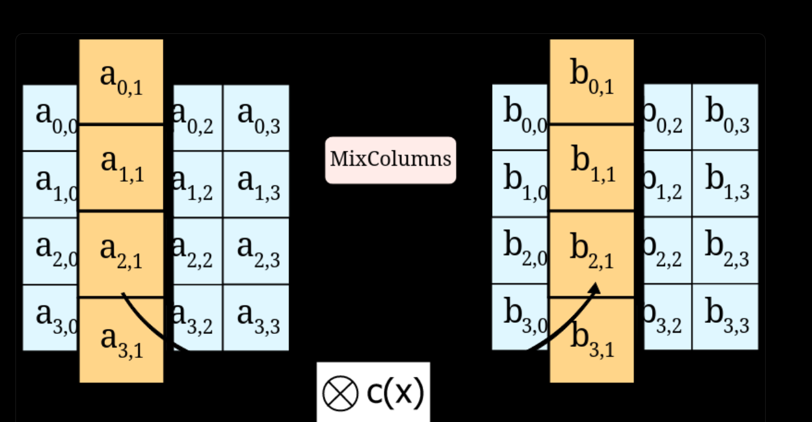

# این متن به کمک مترجم گوگل ترجمه شده و متن اصلی متن انگلیسی است که در ادامه آمده است.این متن ممکن است دارای غلط باشد
# چیست AES
AES بیش از 20 سال است که به عنوان روش رمزگذاری استاندارد توسط دولت فدرال ایالات متحده استفاده می‌شود و هنوز هم به عنوان استانداردی جهانی برای ایمن سازی داده‌های دیجیتال باقی مانده است. در واقع، AES به اندازه کافی قابل اطمینان است که یکی از دو روش رمزگذاری است که ما در Onboardbase برای ذخیره سری‌ها استفاده می‌کنیم.

البته ده‌ها الگوریتم رمزگذاری وجود دارند، اما متداول‌ترین آن‌ها AES مخفف "Advanced Encryption Standard" است، همچنین به نام Rijndael هم شناخته می‌شود. AES یک الگوریتم رمزگذاری است که داده‌های متن ساده را به نسخه‌ای به نام "متن رمز" تبدیل می‌کند که بدون یک کلید رمزگذاری (رمز عبور) برای انسان‌ها یا ماشین‌ها قابل درک نیست.

## رمزگذاری تقارنی در مقابل رمزگذاری نامتقارنی
AES یک الگوریتم "رمز کلید تقارنی" است، به این معنا که همان کلید (یا رمز عبور) برای رمزگذاری و رمزگشایی داده‌ها استفاده می‌شود. این ویژگی مزایا و معایبی دارد که در بخش‌های زیر توضیح داده شده است.

روش‌های نامتقارن از یک کلید عمومی برای رمزگذاری و از یک کلید مخفی برای رمزگشایی استفاده می‌کنند. هر کسی می‌تواند پیام‌های رمزگذاری شده را ارسال کند، اما تنها گیرنده می‌داند چگونه آن‌ها را رمزگشا کند. به عنوان مثال، گواهی‌نامه‌های TLS استفاده شده برای ارتباط امن HTTP (HTTPS) از رمزگذاری نامتقارن بهره می‌برند.

## چرا از رمزگذاری AES استفاده می‌شود
ابتدا، "رمزگذاری بخشی از توسعه نرم‌افزار است". شما از آن در همه جا استفاده می‌کنید: شما نیاز به کلید‌های API دارید تا با خدمات وب ارتباط برقرار کنید، شما نیاز به گواهی‌نامه‌های TLS دارید تا داده‌ها را از طریق اینترنت ارسال کنید، شما نیاز به رمز عبور دارید تا حساب‌های کاربری پیاده سازی کنید و غیره. درک از نحوه کار رمزگذاری AES و نحوه استفاده از آن ریسک حملات ممکن به داده‌ها را کاهش می‌دهد.

رمزگذاری AES به طور معمول "در حد مرز ناقص" است زیرا زمانی طول می‌کشد تا یک کلید را با استفاده از نیروی وحشی شکست دهد. این قدر ایمن است که دولت‌ها از آن برای رمزگذاری پرونده‌های محرمانه استفاده می‌کنند. ویژگی‌های ریاضی آن او را در مقابل حملات ممکن به مقایسه با روش‌های رمزگذاری دیگر مانند Blowfish یا Twofish کمتر آسیب‌پذیر می‌کند.

رمزگذاری AES همچنین سریع‌ترین الگوریتم‌های رمزگذاری تقارنی است، که آن را "عملی‌تر" از رقباهای کندتری مانند Serpent می‌کند. با اهمیت‌تر شدن حریم خصوصی داده‌ها برای کاربران پایانی، ضروری است که سرعت رمزگذاری را در برنامه‌های داده‌ای مانند پلتفرم‌های پیام‌رسانی فوری که E2E رمزگذاری را اجرا می‌کنند، در نظ

ر گرفت. اگر رمزگذاری پیام چند دقیقه به طول می‌انجامید، نرم‌افزار ناامکان می‌شد.

## چگونه رمزگذاری AES کار می‌کند
## 1. مروری بر الگوریتم AES
1. تولید یک کلید
2. تولید یک رمز
3. رمزگذاری/رمزگشایی داده با رمز

### تولید کلید AES
برای رمزگذاری/رمزگشایی داده‌ها، AES به یک عبارت رمز مخفی به نام "کلید" نیاز دارد. هر کسی که دسترسی به کلید داشته باشد، می‌تواند داده‌های شما را رمزگشا کند، بنابراین باید قوی و از دید همه پنهان باشد - تنها برنامه نرم‌افزار باید بتواند به آن دسترسی داشته باشد.

کلید می‌تواند به طور کلی 128، 192، 256 یا 512 بیتی باشد. به عنوان مثال، یک AES با استفاده از یک کلید 512 بیتی به اختصار AES 512 نامیده می‌شود. هر چه کلید بلندتر باشد، امنیت بیشتری دارد، اما سرعت رمزگذاری/رمزگشایی کندتر خواهد بود. 128 بیت معادل 24 کاراکتر در رمزگذاری بیس 64 و 256 بیت معادل 44 کاراکتر است. از آنجا که فضای ذخیره‌سازی به طور معمول مشکلی نیست و تفاوت در سرعت بین نسخه‌ها بسیار اندک است، یک قاعده خوب این است که از کلید‌های 256 بیتی استفاده کنید.

### تولید رمز
رمز یک مجموعه دستورالعمل است که به الگوریتم AES می‌گوید چگونه داده‌ها را رمزگذاری/رمزگشا کند. این از کلید با استفاده از یک فرآیند به نام گسترش کلید تولید می‌شود. رمز برای هر کلید منحصر به فرد است، بنابراین شما باید هر بار که کلید را تغییر دهید، یک رمز جدید تولید کنید.

### رمزگذاری/رمزگشایی داده
AES بر روی بلوک‌های داده به طول 16 بایت که به عنوان آرایه‌های دوبعدی 4x4 نمایش داده می‌شوند عمل می‌کند. محتوای بایت این ماتریس‌ها با استفاده از یک تابع ریاضی تعریف شده توسط رمز (همچنین به نام بلوک رمزگذار) تبدیل می‌شود که ما را به متن رمز شده (متن رمز) می‌رساند.



## 2. اجرای AES در Python با استفاده از PyCryptodome
#### رمزگذاری
```
    key = get_random_bytes(16)
    cipher = AES.new(key, AES.MODE_EAX)
    ciphertext, tag = cipher.encrypt_and_digest(data)
    nonce = cipher.nonce
    return key, cipher, ciphertext, tag, nonce
```
#### رمزگشایی
```    
    cipher = AES.new(key, AES.MODE_EAX, nonce)
    data = cipher.decrypt_and_verify(ciphertext, tag)
    return data
```
#### چیست nonce؟
Nonce یک عدد تصادفی است که می‌تواند تنها یک بار در یک ارتباط رمزنگاری استفاده شود. این مفهوم به روحیه یک کلمه تصادفی نامزد مشابه است، به همین دلیل این نام داده شده است. اغلب یک عدد تصادفی یا شبه‌تصادفی در یک پروتکل احراز هویت صادر می‌شود تا از این جلسه‌های قدیمی در حملات تکراری جلوگیری شود. آن‌ها همچنین می‌توانند به عنوان برداشت‌های مقدماتی و در توابع هش رمزنگاری به کار آید.

##### اطلاعات جذاب درباره nonce در بیت‌کوین
Nonce در یک بلوک بیت‌کوین، یک فیلد 32 بیتی (4 بایت) است که مقدار آن طوری تنظیم شده است ک

ه هش بلوک حاوی یک دنباله صفر اول باشد. سایر فیلدها نباید تغییر داده شوند زیرا معنای مشخصی دارند. هر تغییری در داده‌های بلوک (مانند nonce) باعث می‌شود که هش بلوک کاملاً متفاوت باشد. تا سال 2015، سخت‌افزارهای برجسته بیت‌کوین شامل ASIC‌ها (مدارهای یکپارچه ویژه بیت‌کوین) طراحی شده برای استخراج بیت‌کوین را شامل می‌شود.

## 3. حالات و کاربردهای AES
AES می‌تواند در حالات مختلف بسته به برنامه مورد استفاده استفاده شود. متداول‌ترین حالات ECB، CBC، CFB، OFB و CTR هستند. هر حالت دارای مزایا و معایب خود است، بنابراین مهم است تفاوت‌ها بین آن‌ها را درک کرده و حالت مناسب را برای مورد کاربری خود انتخاب کنید.

### حالت Electronic Codebook (ECB)
ECB ساده‌ترین حالت عملی است. این هر بلوک از داده‌ها را به صورت مستقل با استفاده از همان کلید رمزگذاری می‌کند. این به این معناست که اگر دو بلوک از داده یکسان باشند، آن‌ها به همان متن رمزگذاری می‌شوند. این یک ریسک امنیتی است زیرا اطلاعاتی در مورد داده لو می‌دهد. ECB برای استفاده در پروتکل‌های رمزنگاری توصیه نمی‌شود.

### حالت Cipher Block Chaining (CBC)
CBC متداول‌ترین حالت عملی است. این هر بلوک از داده را با استفاده از متن رمز بلوک قبلی رمزگذاری می‌کند. این به این معناست که اگر دو بلوک از داده یکسان باشند، آن‌ها به متن رمزگذاری متفاوتی تبدیل می‌شوند. این باعث می‌شود که از ECB امن‌تر باشد. CBC برای استفاده در پروتکل‌های رمزنگاری توصیه می‌شود.

### حالت Cipher Feedback (CFB)
CFB یک حالت عملی است که یک رمز بلوک را به یک رمز جریان موازی تبدیل می‌کند. این هر بلوک از داده را با استفاده از متن رمز بلوک قبلی رمزگذاری می‌کند. این به این معناست که اگر دو بلوک از داده یکسان باشند، آن‌ها به متن رمزگذاری متفاوتی تبدیل می‌شوند. این باعث می‌شود که از ECB امن‌تر باشد. CFB برای استفاده در پروتکل‌های رمزنگاری توصیه می‌شود.

### حالت Output Feedback (OFB)
OFB یک حالت عملی است که یک رمز بلوک را به یک رمز جریان موازی تبدیل می‌کند. این هر بلوک از داده را با استفاده از متن رمز بلوک قبلی رمزگذاری می‌کند. این به این معناست که اگر دو بلوک از داده یکسان باشند، آن‌ها به متن رمزگذاری متفاوتی تبدیل می‌شوند. این باعث می‌شود که از ECB امن‌تر باشد. OFB برای استفاده در پروتکل‌های رمزنگاری توصیه می‌شود.

### حالت Counter (CTR)
CTR یک حالت عملی است که یک رمز بلوک را به یک رمز جریان موازی تبدیل می‌کند. این هر بلوک از داده را با استفاده از متن رمز بلوک قبلی رمزگذاری می‌کند. این به این معناست که اگر دو بلوک از داده یکسان باشند، آن‌ها به متن رمزگذاری متفاوتی تبدیل می‌شوند. این باعث می‌شود که از ECB امن‌تر باشد. CTR

 برای استفاده در پروتکل‌های رمزنگاری توصیه می‌شود.

## 4. امنیت AES
AES یک روش رمزگذاری امن است، اما کامل نیست. به عنوان مثال، به حملات کناره‌کانالی حساس است. این حملات از پیاده‌سازی فیزیکی الگوریتم به جای ویژگی‌های ریاضی آن بهره می‌برند. این حملات می‌توانند برای استخراج کلید رمزگذاری از دستگاهی که نرم‌افزار را اجرا می‌کند به کار رود.

همچنین AES به حملات تقویت رمز اعلامی حساس است. این حملات از طریق طرح پر کردن استفاده می‌شوند تا آخرین بلوک داده اگر بلوک 16 بایتی نباشد را پر کنند. این حملات می‌توانند برای رمزگشایی داده بدون داشتن کلید رمزگذاری به کار روند.

#### چیست حملات کناره‌کانالی؟
در امنیت کامپیوتری، حمله کناره‌کانالی هر حمله‌ای است که بر اساس اطلاعاتی که از اجرای فیزیکی یک سیستم کامپیوتری به دست می‌آید، انجام می‌شود، به جای نقاط ضعف در الگوریتم اجرایی خود (مثل رمزگشایی و باگ‌های نرم‌افزاری). اطلاعات زمان‌بندی، مصرف برق، نشتی‌های الکترومغناطیسی و حتی صدا می‌تواند منبع اطلاعات اضافی فراهم کند که می‌تواند برای شکست سیستم استفاده شود. برخی از حملات کناره‌کانالی نیاز به دانش فنی از عملکرد داخلی سیستم دارند، به عنوان مثال حملات تجزیه توان مصرفی.

منابع:
https://www.onboardbase.com/blog/what-is-aes-encryption-and-how-does-it-work/
https://en.wikipedia.org/wiki/Cryptographic_nonce
https://en.wikipedia.org/wiki/Nonce_(bitcoin)
https://www.youtube.com/watch?v=O4xNJsjtN6E