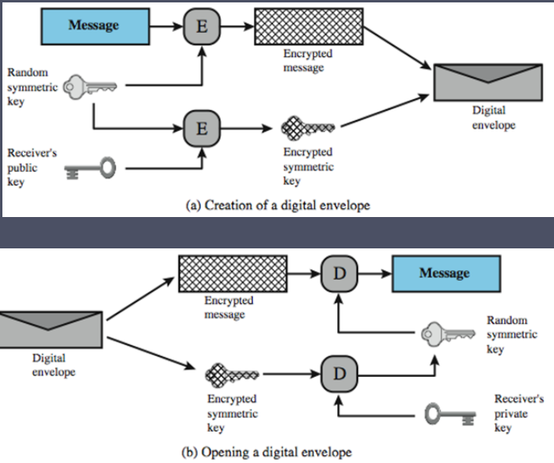

# what is a digital envelope?

A digital envelope is a way to encrypt a message using a symmetric key. The symmetric key is then encrypted using the recipient's public key. The recipient can then decrypt the symmetric key using their private key and then use the symmetric key to decrypt the message.

# how does it work?

The sender generates a random symmetric key and encrypts the message using the symmetric key. The sender then encrypts the symmetric key using the recipient's public key. The recipient can then decrypt the symmetric key using their private key and then use the symmetric key to decrypt the message.

